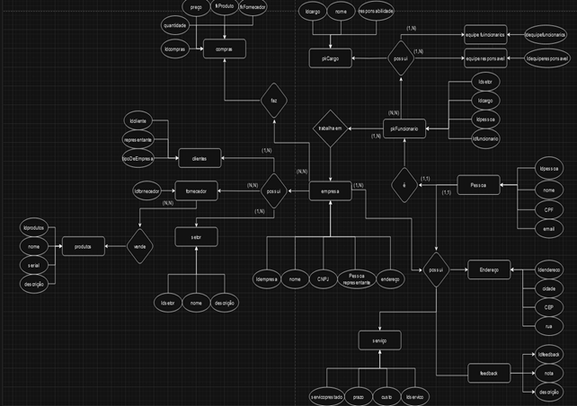

# Modelo conceitual

utilizado para axuliar no desenvolvimento do modelo lógico do banco nosso modelo conceitual apresenta as seguintes entiadades 

## As tabelas que fazem parte do modelo conceitual são:

| coluna | nome da tabela|
|--------|----------------|
|1|produtos| 
|2|clientes| 
|3|fornecedor| 
|4|setor| 
|5|empresa| 
|6|endereço| 
|7|serviços| 
|8|feedback| 
|9|pessoas| 
|10|funcionários | 
|11|equipe responsável| 
|12|equipe funcionários| 
|13|cargo| 
|14|compras|

### Imagem do modelo conceitual:

