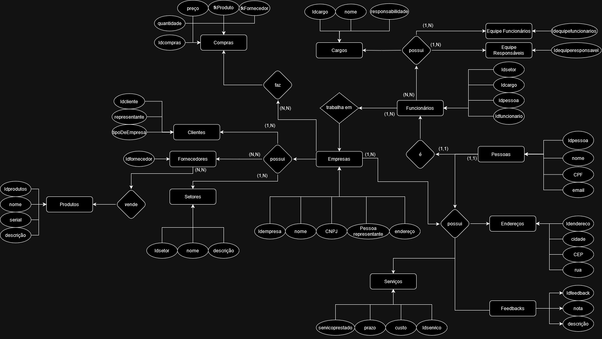

# Modelo conceitual

utilizado para auxiliar no desenvolvimento do modelo lógico do banco nosso modelo conceitual apresenta as seguintes entidades.

## As entidades que fazem parte do modelo conceitual são:

| coluna | nome das entidades|
|--------|----------------|
|1|Produtos| 
|2|Clientes| 
|3|Fornecedores| 
|4|Setores| 
|5|Empresas| 
|6|Endereços| 
|7|Serviços| 
|8|Feedback's| 
|9|Pessoas| 
|10|Funcionários | 
|11|Equipe responsáveis| 
|12|Equipe funcionários| 
|13|Cargos| 
|14|Compras|

### Imagem do modelo conceitual:

