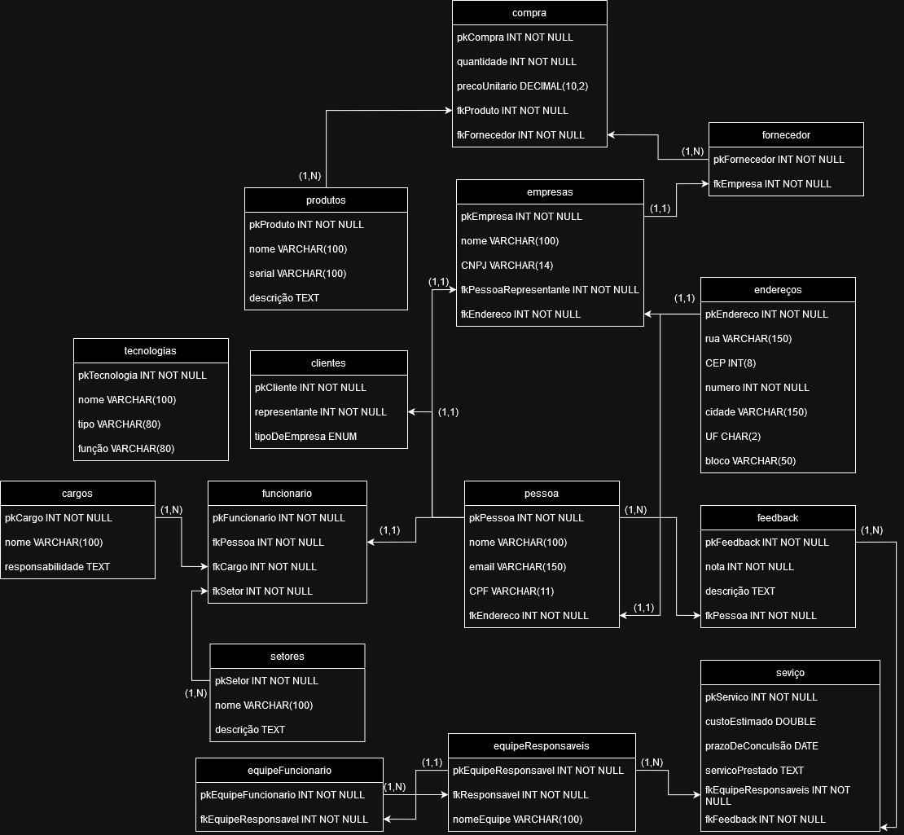

# Modelo lógico do banco de dados

O modelo lógico destaca melhor as entidades, suas características e os relacionamentos entre elas. Ele já apresenta uma normalização nas relações, o que facilita a compreensão e estruturação do banco de dados. 

## As tabelas que fazem parte do modelo lógico são:

|coluna |   Nome da tabela  |    
|-------|-------------------|
|1      | cargos            |  
|2      | clientes          |
|3      | compras           |
|4      | empresas          |
|5      | enderecos         |
|6      | equipefuncionario |
|7      | equiperesonsaveis |
|8      | feedbacks         |
|9      | fornecedores      |
|10     | funcionario       |
|11     | obras             |
|12     | pessoas           |
|13     | produtos          |
|14     | servico           |
|15     | setores           |
|16     | tecnologias       |

### Imagem do diagrama modelo lógico:

