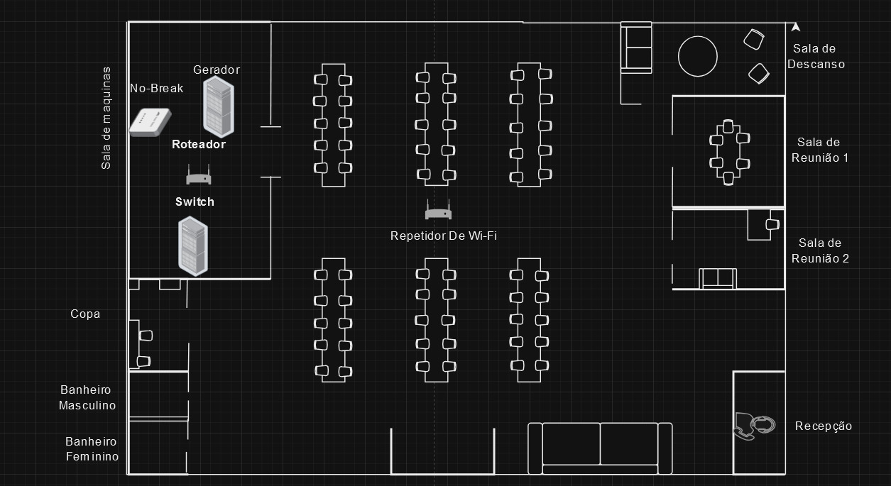

# repositório destinado a apresentar os dispositivos utilizados na rede da empresa

**Dispositivos com IP :**
1. Roteador
2. Monitores
3. computadores
4. Impressoras
5. Televisão
6. Notebooks
7. Repetidor Wi-Fi

**Equipamentos Auxiliares :**
1. Nobreak
2. Gerador
2. Switch

## Dispositivos e IP'S:

|        Nome       | IPv4 address   |
|-------------------|----------------|
|Roteador           |192.168.0.1     |
|Monitor IP         |192.168.0.5     |
|Monitor IP         |192.168.0.6     |
|computadores IP    |192.168.0.7     |
|computadores IP    |192.168.0.8     |
|Impressora IP      |192.168.0.10    |
|Impressora IP      |192.168.0.11    |
|Televisão IP       |192.168.0.12    |
|Monitor IP         |192.168.0.13    |
|Monitor IP         |192.168.0.14    |
|computadores IP    |192.168.0.15    |
|computadores IP    |192.168.0.16    |
|Notebook IP        |192.168.0.17    |
|Notebook IP        |192.168.0.18    |
|Notebook IP        |192.168.0.19    |
|Notebook IP        |192.168.0.20    |
|Repetidor Wi-Fi IP |192.168.0.21    |

## Planta:

